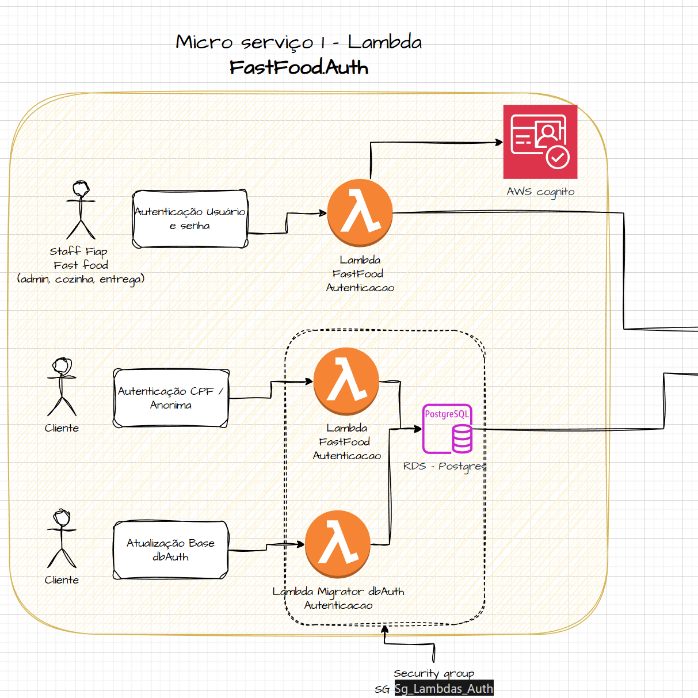
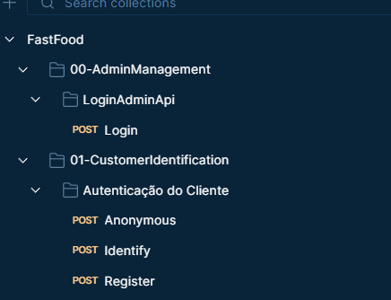

# FastFoodAuth - Microserviço de Autenticação

Microserviço de autenticação do ecossistema FastFood, desenvolvido para o Tech Challenge – Fase 4 da Pós Tech (Arquitetura de Microsserviços).

## 📋 Índice

- [Visão Geral do Serviço de Autenticação](#visão-geral-do-serviço-de-autenticação)
- [Fluxos de Autenticação](#fluxos-de-autenticação)
  - [Autenticação de Administradores (Staff)](#-autenticação-de-administradores-staff)
  - [Autenticação de Clientes (CPF / Anônimo)](#-autenticação-de-clientes-cpf--anônimo)
- [Arquitetura do Serviço](#arquitetura-do-serviço)
- [Clean Architecture](#clean-architecture)
- [Qualidade de Código e Testes](#qualidade-de-código-e-testes)
- [Secrets e Configurações](#secrets-e-configurações)
- [Tecnologias](#tecnologias)
- [Estrutura do Projeto](#estrutura-do-projeto)
- [Como Executar](#como-executar)
- [Documentação da API](#documentação-da-api)
- [Deploy](#deploy)

---

## Visão Geral do Serviço de Autenticação

O microserviço **FastFoodAuth** é responsável por centralizar toda a autenticação do ecossistema FastFood. Ele atende dois perfis distintos:

- **Administradores / Staff** (admin, cozinha, entrega)
- **Clientes finais** (CPF ou anônimo)

### Características Principais

- ✅ **Serviço isolado**: Não é um monolito de autenticação, mas sim um serviço independente, consumido pelos demais microsserviços do ecossistema
- ✅ **Arquitetura serverless**: 100% baseada em AWS Lambda
- ✅ **Separação de responsabilidades**: Fluxos distintos para administradores e clientes
- ✅ **Segurança gerenciada**: AWS Cognito para staff, PostgreSQL para clientes

---

## Fluxos de Autenticação

O FastFoodAuth implementa dois fluxos de autenticação completamente distintos, cada um otimizado para seu perfil de usuário.

### 🔐 Autenticação de Administradores (Staff)

Administradores (admin, cozinha, entrega) realizam login exclusivamente via **AWS Cognito**.

#### Como Funciona

1. O administrador envia credenciais (username e password) para o endpoint `/admin/login`
2. O **Lambda FastFoodAuth** atua como orquestrador:
   - Recebe a requisição via API Gateway
   - Valida as credenciais no AWS Cognito
   - Retorna tokens válidos (AccessToken e IdToken) para acesso aos microsserviços

#### Benefícios

- ✅ **Segurança gerenciada pela AWS**: Cognito oferece recursos prontos de segurança
- ✅ **MFA e políticas prontas**: Suporte nativo a autenticação multifator
- ✅ **Nenhuma senha armazenada na aplicação**: Credenciais gerenciadas pelo Cognito
- ✅ **Auditoria integrada**: Logs e rastreabilidade fornecidos pela AWS

#### Componentes Envolvidos

- **Lambda FastFoodAuth (Admin)**: Handler que processa requisições de autenticação
- **AWS Cognito**: Serviço de autenticação gerenciado
- **IAM Role**: Permissões para o Lambda acessar o Cognito

---

### 👥 Autenticação de Clientes (CPF / Anônimo)

Clientes **não utilizam Cognito**. O fluxo é baseado em:

- **CPF**: Identificação através de CPF (registrado ou identificação)
- **Anônimo**: Criação de sessão anônima sem identificação

#### Como Funciona

1. **Identificação por CPF** (`POST /customer/identify`):
   - Cliente envia CPF
   - Lambda busca o cliente no banco de dados (dbAuth - PostgreSQL)
   - Se encontrado, gera token JWT interno
   - Se não encontrado, retorna 401 (Unauthorized)

2. **Registro por CPF** (`POST /customer/register`):
   - Cliente envia CPF
   - Lambda verifica se já existe
   - Se não existe, cria novo cliente registrado
   - Gera token JWT interno

3. **Sessão Anônima** (`POST /customer/anonymous`):
   - Cliente solicita sessão anônima
   - Lambda cria cliente anônimo no banco
   - Gera token JWT interno

#### Por que não usar Cognito para Clientes?

- ✅ **Simplicidade**: Clientes não precisam de cadastro complexo
- ✅ **Performance**: Menos latência (sem chamadas externas ao Cognito)
- ✅ **Custo**: Redução de custos (sem uso de Cognito para milhões de clientes)
- ✅ **Flexibilidade**: Rastreabilidade mínima do cliente, sem necessidade de políticas complexas

#### Componentes Envolvidos

- **Lambda FastFoodAuth (Customer)**: Handler que processa requisições de clientes
- **RDS PostgreSQL (dbAuth)**: Banco de dados para persistência de clientes
- **TokenService**: Geração de tokens JWT internos
- **Lambda Migrator dbAuth**: Execução de migrations do Entity Framework

---

## Arquitetura do Serviço

O FastFoodAuth é uma arquitetura **100% serverless** baseada em AWS Lambda.



### Componentes Principais

#### Lambdas

1. **Lambda FastFoodAuth (Admin)**
   - Handler: `FastFood.Auth.Lambda.Admin`
   - Responsabilidade: Autenticação de administradores via Cognito
   - Endpoint: `POST /admin/login`

2. **Lambda FastFoodAuth (Customer)**
   - Handler: `FastFood.Auth.Lambda.Customer`
   - Responsabilidade: Identificação, registro e sessão anônima de clientes
   - Endpoints:
     - `POST /customer/identify`
     - `POST /customer/register`
     - `POST /customer/anonymous`

3. **Lambda Migrator dbAuth**
   - Handler: `FastFood.Auth.Migrator`
   - Responsabilidade: Execução de migrations do Entity Framework Core
   - Uso: Atualização do schema do banco de dados

#### Serviços AWS

- **AWS Cognito**: Autenticação de administradores
- **RDS PostgreSQL**: Banco de dados dbAuth para clientes
- **API Gateway**: Roteamento de requisições para os Lambdas

#### Segurança

- **Security Group**: `sg_lambdas_auth`
  - Acesso restrito ao RDS PostgreSQL
  - Isolamento de rede para os Lambdas de autenticação
  - Regras de entrada/saída configuradas

#### Fluxo Geral

1. **Requisição chega via API Gateway**
2. **API Gateway roteia para o Lambda apropriado** (Admin ou Customer)
3. **Lambda processa a requisição**:
   - Admin: Valida no Cognito
   - Customer: Valida/cria no PostgreSQL
4. **Lambda retorna resposta** com token ou erro
5. **API Gateway retorna resposta HTTP** para o cliente

---

## Clean Architecture

O projeto segue aproximadamente **70% dos princípios de Clean Architecture**, com uma abordagem pragmática.

### Decisão Arquitetural

Esta não é uma limitação técnica, mas sim uma **decisão consciente** para:

- ✅ **Reduzir boilerplate**: Menos camadas desnecessárias
- ✅ **Manter simplicidade**: Ambiente serverless não precisa de complexidade excessiva
- ✅ **Foco em valor**: Priorizar entrega de funcionalidades sobre pureza arquitetural

### Características Mantidas

#### ✅ UseCases Isolados

- Lógica de negócio concentrada em UseCases
- UseCases não dependem de frameworks ou infraestrutura
- Testabilidade garantida através de interfaces (Ports)

#### ✅ Regras de Negócio Fora do Handler

- Controllers são apenas adapters de transporte
- Validações e regras no Domain e Application
- Handlers (Lambda) apenas orquestram a chamada

#### ✅ Infra e Providers Desacoplados

- Interfaces (Ports) definidas na Application
- Implementações (Adapters) na Infra
- Fácil substituição de implementações (ex: trocar Cognito por outro provider)

### Decisões Explícitas

#### ⚠️ DI Concentrada na Borda

- Injeção de dependência configurada no `Program.cs` (borda da aplicação)
- Não há frameworks pesados de DI no core
- Simplicidade na configuração

#### ⚠️ Sem Frameworks Pesados no Core

- Domain e Application não dependem de frameworks externos
- Apenas interfaces e contratos
- Facilita testes e manutenção

### Estrutura de Camadas

```
src/
├── Core/
│   ├── FastFood.Auth.Domain/          # Entidades, Value Objects, Regras de Negócio
│   ├── FastFood.Auth.Application/       # UseCases, Ports (Interfaces), Presenters
│   ├── FastFood.Auth.Infra/            # Implementações (CognitoService, TokenService)
│   └── FastFood.Auth.Infra.Persistence/ # Repositórios, EF Core, DbContext
└── InterfacesExternas/
    ├── FastFood.Auth.Lambda.Admin/     # Handler Lambda para Admin
    ├── FastFood.Auth.Lambda.Customer/  # Handler Lambda para Customer
    └── FastFood.Auth.Migrator/         # Console app para migrations
```

### Regras de Dependência

- ✅ **InterfacesExternas** → Application
- ✅ **Application** → Domain
- ✅ **Infra** → Application (implementa Ports)
- ❌ **Domain** não referencia nada externo
- ❌ **Application** não referencia Infra diretamente

---

## Qualidade de Código e Testes

O projeto mantém altos padrões de qualidade através de testes automatizados e análise estática.

### Cobertura de Testes

- **Meta**: Aproximadamente **80%** de cobertura
- **Foco**: UseCases, regras de autenticação, validações de domínio

#### Estrutura de Testes

- **Testes Unitários** (`FastFood.Auth.Tests.Unit`):
  - Domain (entidades, value objects)
  - UseCases (lógica de negócio)
  - Controllers (adapters)
  - Services (CognitoService, TokenService)
  - Repositories

- **Testes BDD** (`FastFood.Auth.Tests.Bdd`):
  - Cenários de comportamento
  - Fluxos end-to-end

#### Executar Testes com Cobertura

```bash
dotnet test /p:CollectCoverage=true /p:CoverletOutputFormat=opencover /p:CoverletOutput=./TestResults/coverage/
```

### Análise Estática

- **SonarQube / SonarCloud**: Análise contínua de qualidade
- **Gate mínimo**: Respeitado no pipeline CI/CD
- **Métricas monitoradas**:
  - Code Smells
  - Bugs
  - Vulnerabilidades
  - Duplicação de código
  - Complexidade ciclomática

### Pipeline CI/CD

O pipeline valida automaticamente:

1. ✅ **Build**: Compilação do projeto
2. ✅ **Testes**: Execução de todos os testes
3. ✅ **Qualidade**: Análise SonarQube
4. ✅ **Deploy**: Apenas se todas as validações passarem

---

## Secrets e Configurações

O projeto utiliza **AWS Secrets Manager** e **variáveis de ambiente** para gerenciar configurações sensíveis.

### Secrets Utilizados

#### 1. Credenciais do Cognito

- **`COGNITO__REGION`**: Região AWS do User Pool
- **`COGNITO__USERPOOLID`**: ID do User Pool
- **`COGNITO__CLIENTID`**: Client ID do aplicativo

**Onde ficam:**
- ✅ AWS Secrets Manager (produção)
- ✅ GitHub Secrets (para deploy via CI/CD)
- ✅ Variáveis de ambiente locais (desenvolvimento)

**Papel:** Configuração do serviço Cognito para autenticação de administradores.

#### 2. Connection String do dbAuth

- **`ConnectionStrings__DefaultConnection`**: String de conexão completa do PostgreSQL

**Onde ficam:**
- ✅ AWS Secrets Manager (produção)
- ✅ GitHub Secrets (para deploy via CI/CD)
- ✅ Variáveis de ambiente locais (desenvolvimento)

**Papel:** Conexão com o banco de dados RDS PostgreSQL onde são armazenados os dados dos clientes.

#### 3. Configurações JWT

- **`JwtSettings__Secret`**: Chave secreta para assinar tokens JWT (mínimo 32 caracteres)
- **`JwtSettings__Issuer`**: Emissor do token
- **`JwtSettings__Audience`**: Audiência do token
- **`JwtSettings__ExpirationHours`**: Tempo de expiração (padrão: 24 horas)

**Onde ficam:**
- ✅ AWS Secrets Manager (produção)
- ✅ GitHub Secrets (para deploy via CI/CD)
- ✅ Variáveis de ambiente locais (desenvolvimento)

**Papel:** Geração de tokens JWT internos para autenticação de clientes.

### Segurança

⚠️ **IMPORTANTE:**

- ✅ **Nada sensível versionado**: Nenhuma credencial está no repositório
- ✅ **AWS Secrets Manager**: Credenciais gerenciadas de forma segura
- ✅ **IAM Role**: Lambdas usam IAM Role (não credenciais explícitas)
- ✅ **GitHub Secrets**: Configurações sensíveis no CI/CD
- ✅ **`.gitignore`**: Arquivos locais de configuração ignorados

### Configuração Local

Para desenvolvimento local, consulte o arquivo [`docs/VARIAVEIS_AMBIENTE.md`](docs/VARIAVEIS_AMBIENTE.md) para detalhes completos sobre variáveis de ambiente.

---

## Tecnologias

### Backend

- **.NET 8**: Framework principal
- **ASP.NET Core**: API REST
- **Amazon.Lambda.AspNetCoreServer**: Hosting Lambda
- **Entity Framework Core**: ORM para PostgreSQL
- **Npgsql**: Driver PostgreSQL

### AWS

- **AWS Lambda**: Execução serverless
- **AWS Cognito**: Autenticação de administradores
- **RDS PostgreSQL**: Banco de dados
- **API Gateway**: Roteamento de requisições
- **IAM**: Gerenciamento de permissões
- **Secrets Manager**: Gerenciamento de secrets

### Testes

- **xUnit**: Framework de testes
- **Moq**: Mocking de dependências
- **coverlet.collector**: Cobertura de código
- **SpecFlow**: Testes BDD

### Infraestrutura como Código

- **Terraform**: Provisionamento de infraestrutura
- **Docker**: Containerização para deploy

---

## Estrutura do Projeto

```
fiap-fase4-auth-lambda/
├── src/
│   ├── Core/
│   │   ├── FastFood.Auth.Domain/              # Entidades, Value Objects
│   │   ├── FastFood.Auth.Application/         # UseCases, Ports, Presenters
│   │   ├── FastFood.Auth.Infra/               # Services (Cognito, Token)
│   │   └── FastFood.Auth.Infra.Persistence/   # Repositórios, EF Core
│   ├── InterfacesExternas/
│   │   ├── FastFood.Auth.Lambda.Admin/        # Lambda Admin
│   │   ├── FastFood.Auth.Lambda.Customer/     # Lambda Customer
│   │   └── FastFood.Auth.Migrator/            # Migrations
│   └── tests/
│       ├── FastFood.Auth.Tests.Unit/           # Testes unitários
│       └── FastFood.Auth.Tests.Bdd/            # Testes BDD
├── terraform/                                 # Infraestrutura como código
├── docs/                                      # Documentação
│   ├── MicroservicoAuth.png                   # Diagrama de arquitetura
│   ├── endpointsAuth.png                      # Diagrama de endpoints
│   ├── CollectionTcFase4.json                 # Collection do Postman
│   ├── VARIAVEIS_AMBIENTE.md                  # Variáveis de ambiente
│   └── DEPLOY_LAMBDA.md                       # Instruções de deploy
└── README.md                                  # Este arquivo
```

---

## Como Executar

### Pré-requisitos

- .NET 8 SDK
- PostgreSQL (local ou RDS)
- AWS CLI configurado (para desenvolvimento local com Cognito)
- Credenciais AWS (para desenvolvimento local)

### Desenvolvimento Local

1. **Configurar variáveis de ambiente** (consulte [`docs/VARIAVEIS_AMBIENTE.md`](docs/VARIAVEIS_AMBIENTE.md))

2. **Executar migrations**:
   ```bash
   dotnet run --project src/InterfacesExternas/FastFood.Auth.Migrator
   ```

3. **Executar Lambda Admin localmente**:
   ```bash
   dotnet run --project src/InterfacesExternas/FastFood.Auth.Lambda.Admin
   ```

4. **Executar Lambda Customer localmente**:
   ```bash
   dotnet run --project src/InterfacesExternas/FastFood.Auth.Lambda.Customer
   ```

5. **Executar testes**:
   ```bash
   dotnet test
   ```

### Endpoints Disponíveis

#### Admin
- `POST /admin/login` - Autenticar administrador

#### Customer
- `POST /customer/identify` - Identificar cliente por CPF
- `POST /customer/register` - Registrar cliente por CPF
- `POST /customer/anonymous` - Criar sessão anônima

---

## Documentação da API

### Diagrama de Endpoints

Abaixo está o diagrama visual dos endpoints do microserviço de autenticação:



### Collection do Postman

Uma collection completa do Postman está disponível para facilitar os testes da API. A collection inclui:

- ✅ **Autenticação de Administradores**: Endpoint de login com Cognito
- ✅ **Autenticação de Clientes**: Endpoints de identify, register e anonymous
- ✅ **Scripts de teste automáticos**: Captura automática de tokens
- ✅ **Variáveis de ambiente**: Configuração simplificada de URLs

#### Como Usar

1. **Importar a Collection**:
   - Abra o Postman
   - Clique em **Import**
   - Selecione o arquivo [`docs/CollectionTcFase4.json`](docs/CollectionTcFase4.json)

2. **Configurar Variáveis**:
   - Configure as variáveis `urlLambdaAdmin` e `urlAuthCustomer` com as URLs dos seus Lambdas
   - Exemplo:
     - `urlLambdaAdmin`: `https://seu-api-gateway.execute-api.us-east-1.amazonaws.com/`
     - `urlAuthCustomer`: `https://seu-api-gateway.execute-api.us-east-1.amazonaws.com/`

3. **Executar Requisições**:
   - Execute primeiro o login de admin ou a autenticação de cliente
   - Os tokens serão automaticamente salvos nas variáveis globais
   - Use os tokens nas requisições subsequentes

#### Estrutura da Collection

A collection está organizada em seções:

- **00-AdminManagement**: Autenticação de administradores
- **01-CustomerIdentification**: Autenticação de clientes (identify, register, anonymous)

Cada requisição inclui scripts de teste que validam a resposta e salvam tokens automaticamente.

---

## Deploy

O deploy é realizado através de **Terraform** e **GitHub Actions**.

### Pré-requisitos

- Terraform instalado
- Credenciais AWS configuradas
- GitHub Secrets configurados

### Processo de Deploy

1. **Build e Push para ECR**:
   - Docker images são construídas
   - Imagens são enviadas para Amazon ECR

2. **Terraform Apply**:
   - Provisiona/atualiza recursos AWS
   - Configura Lambdas com variáveis de ambiente
   - Configura API Gateway
   - Configura Security Groups

3. **Validação**:
   - Testes são executados
   - Análise SonarQube é realizada
   - Apenas se passar, o deploy é concluído

Para mais detalhes, consulte [`docs/DEPLOY_LAMBDA.md`](docs/DEPLOY_LAMBDA.md).

---

## Contribuindo

Este é um projeto acadêmico desenvolvido para o Tech Challenge – Fase 4. Para questões ou sugestões, consulte a documentação em `docs/` ou as regras de arquitetura em `rules/`.

---

## Licença

Este projeto é parte do Tech Challenge da Pós Tech (Arquitetura de Microsserviços) e é destinado exclusivamente para fins educacionais.
